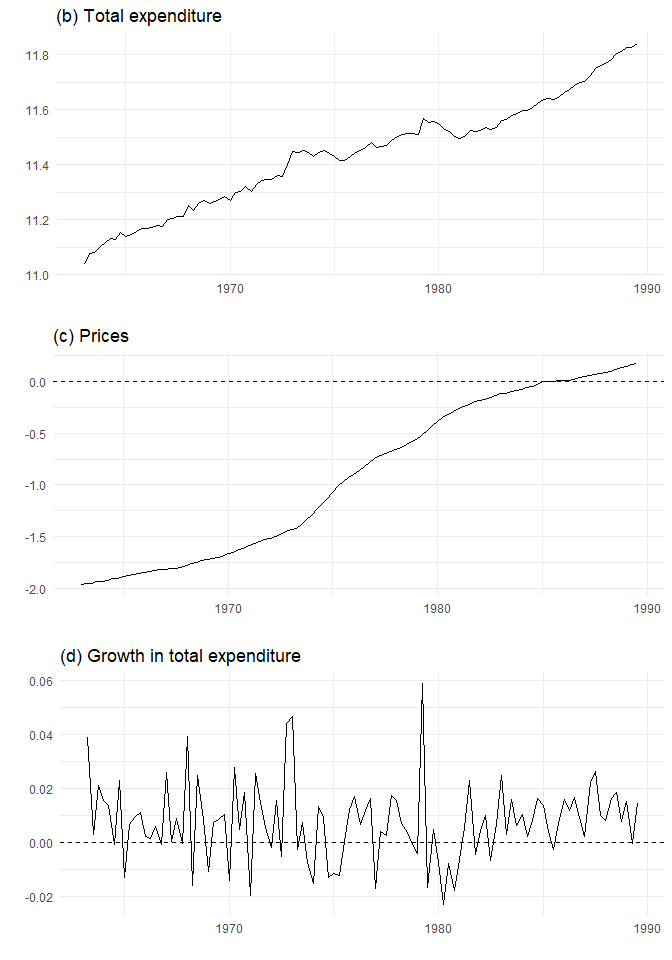
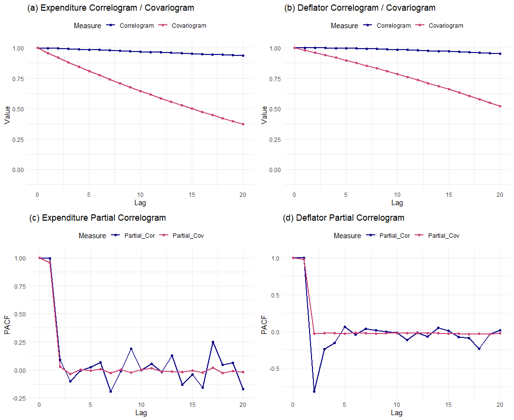
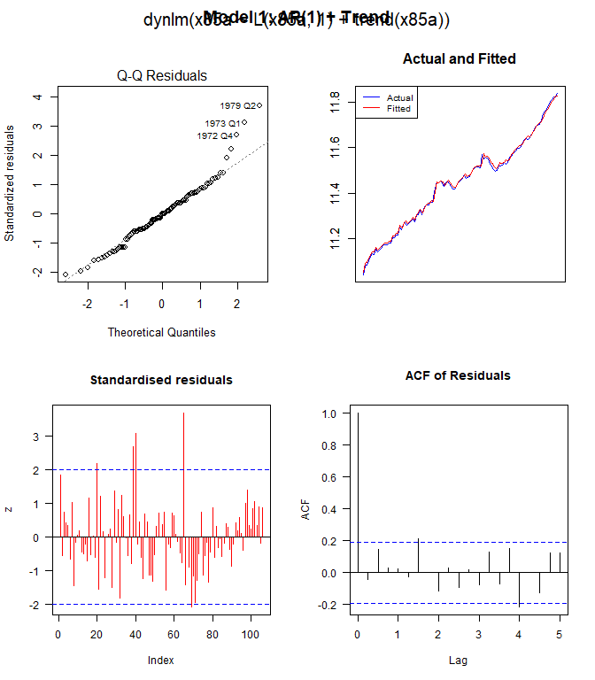
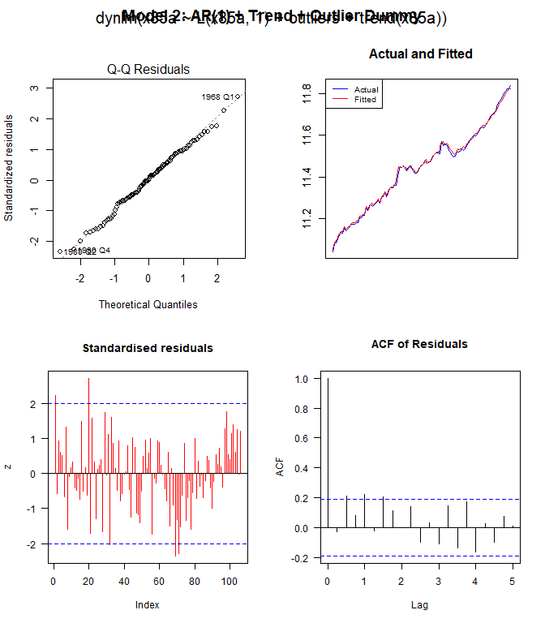
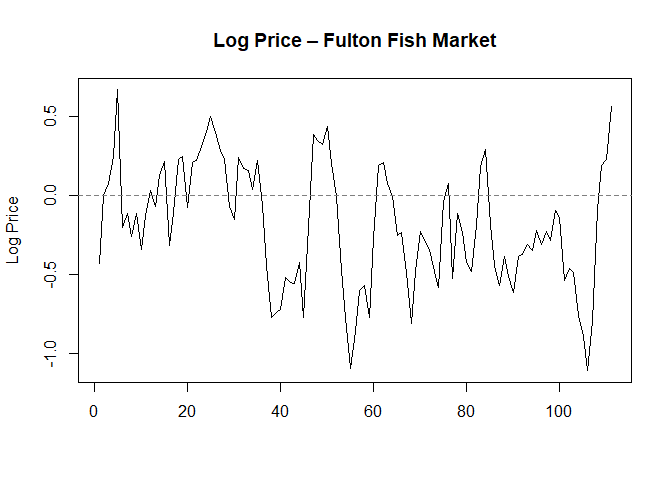

Econometrics 871 – Tutorial 3
================
Willem Boshoff (compiled by R. van Jaarsveld & L. McLean; updated C.F.
Kreuser, 2025; new version by Precious Nhamo, 2026)
2026-02-26

- [Setting Up](#setting-up)
  - [Load Environment](#load-environment)
  - [Project Structure](#project-structure)
- [Replicating HN Chapter 16.1 – Visual
  Inspection](#replicating-hn-chapter-161--visual-inspection)
  - [Time-Series Plots (Figure 16.1)](#time-series-plots-figure-161)
  - [Correlograms and Partial Correlograms (Figure
    16.2)](#correlograms-and-partial-correlograms-figure-162)
    - [Theory](#theory)
    - [Computation](#computation)
- [Consequences of Non-Stationarity (HN
  §16.3)](#consequences-of-non-stationarity-hn-163)
  - [Model 1: AR(1) with Trend (Table
    16.1)](#model-1-ar1-with-trend-table-161)
    - [Diagnostic Plots (Figure 16.3 /
      16.4)](#diagnostic-plots-figure-163--164)
    - [Formal Misspecification Tests](#formal-misspecification-tests)
  - [Model 2: AR(1) + Trend + Outlier
    Dummy](#model-2-ar1--trend--outlier-dummy)
  - [Model 3: Re-parameterised in First
    Differences](#model-3-re-parameterised-in-first-differences)
  - [Likelihood-Ratio Unit-Root Test (HN
    §16.3)](#likelihood-ratio-unit-root-test-hn-163)
- [Testing for a Unit Root – Fulton Fish Market (HN
  §16.5.2)](#testing-for-a-unit-root--fulton-fish-market-hn-1652)
  - [Visual Inspection](#visual-inspection)
  - [Model 5: AR(1) in Levels with Weather
    Dummies](#model-5-ar1-in-levels-with-weather-dummies)
  - [Model 6: Re-parameterised in First
    Differences](#model-6-re-parameterised-in-first-differences)
  - [Model 7: Demeaned Weather
    Dummies](#model-7-demeaned-weather-dummies)
  - [Model 8: Restricted (Unit-Root
    Null)](#model-8-restricted-unit-root-null)
  - [Automated ADF Test (for
    Comparison)](#automated-adf-test-for-comparison)
- [Summary](#summary)
- [Session Information](#session-information)

# Setting Up

## Load Environment

We source `main.R`, which handles:

- Clearing the workspace
- Installing / loading all packages via **pacman**
- Sourcing every helper function from the `code/` directory
- Reading the two datasets from `data/` directory : (`ukm1q.txt` and
  `fulton.txt`)
- Creating `ts` and `xts` objects

``` r
source("main.R")
```

    ## 
    ## --- Tutorial 3 environment ready ---
    ## Objects loaded: ukm1q, fulton, fulton_xts, ukm1q_xts, x85a, dx85a, pa
    ## Helper functions: fit_actual, z_resids, compute_alpha, compute_partial_alpha, run_diagnostics, plot_diagnostics

## Project Structure

    tutorial3_project/
    ├── main.R                       # Master setup R script
    ├── Tutorial_3.Rmd               # This R Markdown document
    └── code/
        ├── ukm1q.txt                # UK macroeconomic data
        ├── fulton.txt               # Fulton fish market data
    └── code/
        ├── fit_actual.R             # Overlay actual vs. fitted
        ├── z_resids.R               # Standardised-residual plot
        ├── compute_alpha.R          # Sample autocorrelation
        ├── compute_partial_alpha.R  # Partial autocorrelation (OLS)
        ├── run_diagnostics.R        # Misspecification test battery
        └── plot_diagnostics.R       # 2×2 diagnostic panel

# Replicating HN Chapter 16.1 – Visual Inspection

## Time-Series Plots (Figure 16.1)

We plot three key series from the UK M1 dataset:

- **(b) Total expenditure** ($x_{85a,t}$): log real total expenditure at
  1985 prices. Exhibits a clear upward trend — characteristic of a
  *trending non-stationary* process.
- **(c) Prices** ($p_{a,t}$): log GDP deflator. Also exhibits persistent
  dynamics (slow mean-reversion).
- **(d) Growth in total expenditure**
  ($\Delta x_{85a,t} = x_{85a,t} - x_{85a,t-1}$): The first difference
  appears *stationary* — fluctuating around a constant mean.

``` r
p1 <- autoplot(x85a) +
    ggtitle("(b) Total expenditure") +
    ylab("") + xlab("") +
    theme_minimal()

p2 <- autoplot(pa) +
    ggtitle("(c) Prices") +
    ylab("") + xlab("") +
    geom_hline(yintercept = 0, linetype = "dashed", colour = "black") +
    theme_minimal()

p3 <- autoplot(dx85a) +
    ggtitle("(d) Growth in total expenditure") +
    ylab("") + xlab("") +
    geom_hline(yintercept = 0, linetype = "dashed", colour = "black") +
    theme_minimal()

grid.arrange(p1, p2, p3, ncol = 1)
```



**Interpretation:** The levels series ($x_{85a}$ and $p_a$) trend
upward, suggesting non-stationarity. The differenced series
$\Delta x_{85a}$ fluctuates around zero with roughly constant variance —
consistent with stationarity (see HN p. 240–241).

## Correlograms and Partial Correlograms (Figure 16.2)

### Theory

The **autocorrelation function (ACF)** at lag $s$ is:

$$
\hat{\alpha}(s) = \frac{\text{Cov}(y_t,\; y_{t-s})}{\text{SD}(y_t)\;\text{SD}(y_{t-s})}
$$

For a stationary process this simplifies to
$\rho(s) = \gamma(s) / \gamma(0)$, where
$\gamma(s) = \text{Cov}(y_t, y_{t-s})$.

The **partial autocorrelation function (PACF)** at lag $s$ is the
coefficient $\hat{\phi}_s$ from the OLS regression:

$$
y_t = \phi_1 y_{t-1} + \phi_2 y_{t-2} + \cdots + \phi_s y_{t-s} + u_t
$$

It isolates the *direct* linear dependence between $y_t$ and $y_{t-s}$,
removing the influence of intervening lags.

**Key diagnostic:**

- A *slowly decaying* ACF + a PACF that cuts off after lag 1 is the
  signature of a unit-root (or near-unit-root) process.

### Computation

``` r
max_lag <- 20
lags    <- 0:max_lag

# ---------- Autocorrelation (custom vs. built-in) ----------

# Custom correlogram (our compute_alpha function)
alpha_total <- sapply(lags, function(s) compute_alpha(x85a, s))
alpha_defl  <- sapply(lags, function(s) compute_alpha(pa, s))

# Built-in ACF for comparison
acf_total <- acf(x85a, plot = FALSE, type = "cor", lag.max = max_lag)$acf[1:(max_lag + 1)]
acf_defl  <- acf(pa,   plot = FALSE, type = "cor", lag.max = max_lag)$acf[1:(max_lag + 1)]

# ---------- Partial autocorrelation (custom vs. built-in) ----------

partial_total_custom  <- sapply(lags, function(s) compute_partial_alpha(x85a, s))
partial_total_builtin <- c(1, acf(x85a, plot = FALSE, type = "partial",
                                   lag.max = max_lag)$acf[1:max_lag])

partial_defl_custom  <- sapply(lags, function(s) compute_partial_alpha(pa, s))
partial_defl_builtin <- c(1, acf(pa, plot = FALSE, type = "partial",
                                  lag.max = max_lag)$acf[1:max_lag])

# ---------- Reshape to long format for ggplot ----------

df_total_alpha <- melt(
    data.frame(Lag = lags, Correlogram = alpha_total, Covariogram = acf_total),
    id.vars = "Lag", variable.name = "Measure", value.name = "Value"
)

df_defl_alpha <- melt(
    data.frame(Lag = lags, Correlogram = alpha_defl, Covariogram = acf_defl),
    id.vars = "Lag", variable.name = "Measure", value.name = "Value"
)

df_total_partial <- melt(
    data.frame(Lag = lags, Partial_Cor = partial_total_custom,
               Partial_Cov = partial_total_builtin),
    id.vars = "Lag", variable.name = "Measure", value.name = "Value"
)

df_defl_partial <- melt(
    data.frame(Lag = lags, Partial_Cor = partial_defl_custom,
               Partial_Cov = partial_defl_builtin),
    id.vars = "Lag", variable.name = "Measure", value.name = "Value"
)

# ---------- Colour palette ----------
pal <- viridis(3, option = "plasma")

# ---------- Build plots ----------
p1 <- ggplot(df_total_alpha, aes(Lag, Value, colour = Measure, group = Measure)) +
    geom_line(linewidth = 0.8) + geom_point(size = 1.5) +
    labs(title = "(a) Expenditure Correlogram / Covariogram", y = "Value") +
    scale_colour_manual(values = pal[1:2]) +
    scale_y_continuous(limits = c(-0.1, 1)) +
    theme_minimal() + theme(legend.position = "top")

p2 <- ggplot(df_defl_alpha, aes(Lag, Value, colour = Measure, group = Measure)) +
    geom_line(linewidth = 0.8) + geom_point(size = 1.5) +
    labs(title = "(b) Deflator Correlogram / Covariogram", y = "Value") +
    scale_colour_manual(values = pal[1:2]) +
    scale_y_continuous(limits = c(-0.1, 1)) +
    theme_minimal() + theme(legend.position = "top")

p3 <- ggplot(df_total_partial, aes(Lag, Value, colour = Measure, group = Measure)) +
    geom_line(linewidth = 0.8) + geom_point(size = 1.5) +
    labs(title = "(c) Expenditure Partial Correlogram", y = "PACF") +
    scale_colour_manual(values = pal[1:2]) +
    theme_minimal() + theme(legend.position = "top")

p4 <- ggplot(df_defl_partial, aes(Lag, Value, colour = Measure, group = Measure)) +
    geom_line(linewidth = 0.8) + geom_point(size = 1.5) +
    labs(title = "(d) Deflator Partial Correlogram", y = "PACF") +
    scale_colour_manual(values = pal[1:2]) +
    theme_minimal() + theme(legend.position = "top")

grid.arrange(p1, p2, p3, p4, ncol = 2, nrow = 2)
```



**Interpretation:** Both expenditure and the deflator show ACFs that
decay *very* slowly — consistent with unit-root behaviour. The PACFs
spike at lag 1 and then drop, which is the textbook pattern for an AR(1)
process with $\phi \approx 1$.

# Consequences of Non-Stationarity (HN §16.3)

## Model 1: AR(1) with Trend (Table 16.1)

We estimate an AR(1) model with a deterministic time trend:

$$
x_{85a,t} = \beta_0 + \beta_1\, x_{85a,t-1} + \beta_2\, t + \varepsilon_t
$$

where $t$ is a linear trend index.

``` r
m1 <- dynlm(x85a ~ L(x85a, 1) + trend(x85a))
summary(m1)
```

    ## 
    ## Time series regression with "ts" data:
    ## Start = 1963(2), End = 1989(3)
    ## 
    ## Call:
    ## dynlm(formula = x85a ~ L(x85a, 1) + trend(x85a))
    ## 
    ## Residuals:
    ##       Min        1Q    Median        3Q       Max 
    ## -0.029086 -0.008131 -0.000193  0.008180  0.051404 
    ## 
    ## Coefficients:
    ##              Estimate Std. Error t value Pr(>|t|)    
    ## (Intercept) 0.9088423  0.4283799   2.122   0.0363 *  
    ## L(x85a, 1)  0.9187751  0.0386087  23.797   <2e-16 ***
    ## trend(x85a) 0.0020315  0.0009842   2.064   0.0415 *  
    ## ---
    ## Signif. codes:  0 '***' 0.001 '**' 0.01 '*' 0.05 '.' 0.1 ' ' 1
    ## 
    ## Residual standard error: 0.01405 on 103 degrees of freedom
    ## Multiple R-squared:  0.995,  Adjusted R-squared:  0.9949 
    ## F-statistic: 1.015e+04 on 2 and 103 DF,  p-value: < 2.2e-16

### Diagnostic Plots (Figure 16.3 / 16.4)

``` r
plot_diagnostics(m1, x85a, title = "Model 1: AR(1) + Trend")
```



### Formal Misspecification Tests

``` r
knitr::kable(run_diagnostics(m1, bg_order = 5),
             caption = "Model 1 – Misspecification Tests")
```

| Test                      | Statistic | p_value |
|:--------------------------|----------:|--------:|
| Breusch-Godfrey (order 5) |    0.5611 |  0.7295 |
| Breusch-Pagan             |    1.2610 |  0.5323 |
| Jarque-Bera               |   20.7282 |  0.0000 |
| RESET                     |    2.8224 |  0.0642 |

Model 1 – Misspecification Tests

**Key observations:**

- $\hat{\beta}_1 \approx 0.919$ — very close to 1, suggesting a
  near-unit root.
- $R^2 \approx 0.995$ — *spuriously* high due to the shared stochastic
  trend.
- The Jarque–Bera test rejects normality (driven by three positive
  outliers: 1972 Q4, 1973 Q1, 1979 Q2).

## Model 2: AR(1) + Trend + Outlier Dummy

To address the normality problem, we add a dummy variable for the three
outlier quarters:

$$
x_{85a,t} = \beta_0 + \beta_1\, x_{85a,t-1} + \beta_2\, D_t^{\text{outlier}} + \beta_3\, t + \varepsilon_t
$$

where $D_t^{\text{outlier}} = 1$ for
$t \in \{1972\text{Q}4,\; 1973\text{Q}1,\; 1979\text{Q}2\}$.

``` r
# Create outlier dummy using explicit quarter matching
target_quarters <- as.yearqtr(c("1972 Q4", "1973 Q1", "1979 Q2"))
outliers        <- ts(numeric(length(x85a)), start = start(x85a), frequency = 4)
ts_quarters     <- as.yearqtr(time(outliers))
outliers[ts_quarters %in% target_quarters] <- 1
```

``` r
m2 <- dynlm(x85a ~ L(x85a, 1) + outliers + trend(x85a))
summary(m2)
```

    ## 
    ## Time series regression with "ts" data:
    ## Start = 1963(2), End = 1989(3)
    ## 
    ## Call:
    ## dynlm(formula = x85a ~ L(x85a, 1) + outliers + trend(x85a))
    ## 
    ## Residuals:
    ##       Min        1Q    Median        3Q       Max 
    ## -0.027562 -0.007160  0.000164  0.008161  0.031747 
    ## 
    ## Coefficients:
    ##              Estimate Std. Error t value Pr(>|t|)    
    ## (Intercept) 1.1435705  0.3630036   3.150  0.00214 ** 
    ## L(x85a, 1)  0.8974655  0.0327188  27.430  < 2e-16 ***
    ## outliers    0.0456810  0.0069781   6.546 2.41e-09 ***
    ## trend(x85a) 0.0025961  0.0008344   3.111  0.00242 ** 
    ## ---
    ## Signif. codes:  0 '***' 0.001 '**' 0.01 '*' 0.05 '.' 0.1 ' ' 1
    ## 
    ## Residual standard error: 0.01185 on 102 degrees of freedom
    ## Multiple R-squared:  0.9964, Adjusted R-squared:  0.9963 
    ## F-statistic:  9531 on 3 and 102 DF,  p-value: < 2.2e-16

``` r
plot_diagnostics(m2, x85a, title = "Model 2: AR(1) + Trend + Outlier Dummy")
```



``` r
knitr::kable(run_diagnostics(m2, bg_order = 5),
             caption = "Model 2 – Misspecification Tests")
```

| Test                      | Statistic | p_value |
|:--------------------------|----------:|--------:|
| Breusch-Godfrey (order 5) |    2.3639 |  0.0453 |
| Breusch-Pagan             |    2.1924 |  0.5335 |
| Jarque-Bera               |    0.2574 |  0.8792 |
| RESET                     |    7.5281 |  0.0009 |

Model 2 – Misspecification Tests

**Key observations:**

- The normality issue is resolved by controlling for the outliers.
- However, note the *still very high* $\hat{\beta}_1 \approx 0.897$ and
  $R^2 \approx 0.996$.
- Residual autocorrelation is now a concern (check BG test at various
  lags).

## Model 3: Re-parameterised in First Differences

We subtract $x_{85a,t-1}$ from both sides:

$$
\Delta x_{85a,t} = \beta_0 + (\beta_1 - 1)\, x_{85a,t-1} + \beta_2\, D_t^{\text{outlier}} + \beta_3\, t + \varepsilon_t
$$

This is algebraically *identical* to Model 2 but the dependent variable
is now $\Delta x_{85a,t}$, which is stationary. The coefficient on
$x_{85a,t-1}$ becomes $\hat{\beta}_1 - 1 \approx -0.103$.

``` r
m3 <- dynlm(d(x85a, 1) ~ L(x85a, 1) + outliers + trend(x85a))
summary(m3)
```

    ## 
    ## Time series regression with "ts" data:
    ## Start = 1963(2), End = 1989(3)
    ## 
    ## Call:
    ## dynlm(formula = d(x85a, 1) ~ L(x85a, 1) + outliers + trend(x85a))
    ## 
    ## Residuals:
    ##       Min        1Q    Median        3Q       Max 
    ## -0.027562 -0.007160  0.000164  0.008161  0.031747 
    ## 
    ## Coefficients:
    ##               Estimate Std. Error t value Pr(>|t|)    
    ## (Intercept)  1.1435705  0.3630036   3.150  0.00214 ** 
    ## L(x85a, 1)  -0.1025345  0.0327188  -3.134  0.00225 ** 
    ## outliers     0.0456810  0.0069781   6.546 2.41e-09 ***
    ## trend(x85a)  0.0025961  0.0008344   3.111  0.00242 ** 
    ## ---
    ## Signif. codes:  0 '***' 0.001 '**' 0.01 '*' 0.05 '.' 0.1 ' ' 1
    ## 
    ## Residual standard error: 0.01185 on 102 degrees of freedom
    ## Multiple R-squared:  0.3249, Adjusted R-squared:  0.305 
    ## F-statistic: 16.36 on 3 and 102 DF,  p-value: 9.392e-09

**Crucial insight:** The residuals, coefficients, and log-likelihood are
*identical* to Model 2 (ML estimation is invariant to invertible
parameter transformations). Yet $R^2$ drops from 0.996 to about 0.325 —
revealing that the “excellent fit” in levels was an artefact of the
shared stochastic trend, not genuine explanatory power.

## Likelihood-Ratio Unit-Root Test (HN §16.3)

To test the unit-root hypothesis we treat Model 3 as the
**unrestricted** model and impose two restrictions:

1.  $\beta_1 - 1 = 0$ (i.e. $\beta_1 = 1$, a unit root in the levels
    model)
2.  $\beta_3 = 0$ (no deterministic trend)

The **restricted** model is simply:

$$
\Delta x_{85a,t} = \beta_2\, D_t^{\text{outlier}} + \varepsilon_t
$$

``` r
m4 <- dynlm(d(x85a, 1) ~ outliers)
summary(m4)
```

    ## 
    ## Time series regression with "ts" data:
    ## Start = 1963(2), End = 1989(3)
    ## 
    ## Call:
    ## dynlm(formula = d(x85a, 1) ~ outliers)
    ## 
    ## Residuals:
    ##       Min        1Q    Median        3Q       Max 
    ## -0.029201 -0.006870  0.000701  0.008854  0.032948 
    ## 
    ## Coefficients:
    ##             Estimate Std. Error t value Pr(>|t|)    
    ## (Intercept) 0.006341   0.001211   5.237 8.55e-07 ***
    ## outliers    0.043471   0.007197   6.040 2.42e-08 ***
    ## ---
    ## Signif. codes:  0 '***' 0.001 '**' 0.01 '*' 0.05 '.' 0.1 ' ' 1
    ## 
    ## Residual standard error: 0.01229 on 104 degrees of freedom
    ## Multiple R-squared:  0.2597, Adjusted R-squared:  0.2526 
    ## F-statistic: 36.48 on 1 and 104 DF,  p-value: 2.42e-08

``` r
# Likelihood-ratio test
lr_result <- lmtest::lrtest(m3, m4)
lr_result
```

    ## Likelihood ratio test
    ## 
    ## Model 1: d(x85a, 1) ~ L(x85a, 1) + outliers + trend(x85a)
    ## Model 2: d(x85a, 1) ~ outliers
    ##   #Df LogLik Df  Chisq Pr(>Chisq)   
    ## 1   5 321.79                        
    ## 2   3 316.91 -2 9.7685   0.007565 **
    ## ---
    ## Signif. codes:  0 '***' 0.001 '**' 0.01 '*' 0.05 '.' 0.1 ' ' 1

**Result:** The LR statistic must be compared to the **Dickey–Fuller**
distribution (not the usual $\chi^2$), because the null hypothesis
places us on the boundary of the parameter space. The 5 % critical value
from the DF table for this joint test is approximately **12.4**. Since
our test statistic falls below this threshold, we **cannot reject** the
null of a unit root.

# Testing for a Unit Root – Fulton Fish Market (HN §16.5.2)

## Visual Inspection

``` r
ts.plot(fulton$LogPrice, ylab = "Log Price", xlab = "",
        main = "Log Price – Fulton Fish Market")
abline(h = 0, lty = 2, col = "grey50")
```



The series fluctuates around zero with no obvious trend. A Spanos-window
inspection does not suggest shifts in mean or variance. We therefore
test for a unit root **without** a constant or trend.

## Model 5: AR(1) in Levels with Weather Dummies

$$
\text{LogPrice}_t = \alpha + \phi\,\text{LogPrice}_{t-1} + \gamma_1\,\text{Stormy}_t + \gamma_2\,\text{Mixed}_t + u_t
$$

``` r
m5 <- lm(LogPrice ~ lag.xts(LogPrice, 1) + Stormy + Mixed, data = fulton_xts)
summary(m5)
```

    ## 
    ## Call:
    ## lm(formula = LogPrice ~ lag.xts(LogPrice, 1) + Stormy + Mixed, 
    ##     data = fulton_xts)
    ## 
    ## Residuals:
    ##      Min       1Q   Median       3Q      Max 
    ## -0.65857 -0.14870  0.01073  0.13764  0.48260 
    ## 
    ## Coefficients:
    ##                      Estimate Std. Error t value Pr(>|t|)    
    ## (Intercept)          -0.17003    0.04101  -4.147 6.82e-05 ***
    ## lag.xts(LogPrice, 1)  0.67249    0.06358  10.578  < 2e-16 ***
    ## Stormy                0.25158    0.05834   4.312 3.63e-05 ***
    ## Mixed                 0.13741    0.05451   2.521   0.0132 *  
    ## ---
    ## Signif. codes:  0 '***' 0.001 '**' 0.01 '*' 0.05 '.' 0.1 ' ' 1
    ## 
    ## Residual standard error: 0.2364 on 106 degrees of freedom
    ##   (1 observation deleted due to missingness)
    ## Multiple R-squared:  0.6296, Adjusted R-squared:  0.6191 
    ## F-statistic: 60.06 on 3 and 106 DF,  p-value: < 2.2e-16

## Model 6: Re-parameterised in First Differences

Subtracting $\text{LogPrice}_{t-1}$ from both sides:

$$
\Delta\text{LogPrice}_t = \alpha + (\phi - 1)\,\text{LogPrice}_{t-1} + \gamma_1\,\text{Stormy}_t + \gamma_2\,\text{Mixed}_t + u_t
$$

``` r
m6 <- lm(diff.xts(LogPrice, 1) ~ lag.xts(LogPrice, 1) + Stormy + Mixed,
          data = fulton_xts)
summary(m6)
```

    ## 
    ## Call:
    ## lm(formula = diff.xts(LogPrice, 1) ~ lag.xts(LogPrice, 1) + Stormy + 
    ##     Mixed, data = fulton_xts)
    ## 
    ## Residuals:
    ##      Min       1Q   Median       3Q      Max 
    ## -0.65857 -0.14870  0.01073  0.13764  0.48260 
    ## 
    ## Coefficients:
    ##                      Estimate Std. Error t value Pr(>|t|)    
    ## (Intercept)          -0.17003    0.04101  -4.147 6.82e-05 ***
    ## lag.xts(LogPrice, 1) -0.32751    0.06358  -5.151 1.20e-06 ***
    ## Stormy                0.25158    0.05834   4.312 3.63e-05 ***
    ## Mixed                 0.13741    0.05451   2.521   0.0132 *  
    ## ---
    ## Signif. codes:  0 '***' 0.001 '**' 0.01 '*' 0.05 '.' 0.1 ' ' 1
    ## 
    ## Residual standard error: 0.2364 on 106 degrees of freedom
    ##   (1 observation deleted due to missingness)
    ## Multiple R-squared:  0.2462, Adjusted R-squared:  0.2248 
    ## F-statistic: 11.54 on 3 and 106 DF,  p-value: 1.319e-06

**Note:** Residuals and log-likelihood are identical to Model 5; $R^2$
drops substantially, same lesson as before.

## Model 7: Demeaned Weather Dummies

Dummy variables that persist over time can mimic a deterministic trend.
De-meaning removes this cumulative effect:

$$
\widetilde{D}_t = D_t - \bar{D}
$$

``` r
# De-mean the weather dummies (excluding the first obs to match HN)
fulton_xts$Mixed  <- fulton_xts$Mixed  - mean(fulton_xts$Mixed[-1])
fulton_xts$Stormy <- fulton_xts$Stormy - mean(fulton_xts$Stormy[-1])

m7 <- lm(diff.xts(LogPrice, 1) ~ lag.xts(LogPrice, 1) + Stormy + Mixed,
          data = fulton_xts)
summary(m7)
```

    ## 
    ## Call:
    ## lm(formula = diff.xts(LogPrice, 1) ~ lag.xts(LogPrice, 1) + Stormy + 
    ##     Mixed, data = fulton_xts)
    ## 
    ## Residuals:
    ##      Min       1Q   Median       3Q      Max 
    ## -0.65857 -0.14870  0.01073  0.13764  0.48260 
    ## 
    ## Coefficients:
    ##                      Estimate Std. Error t value Pr(>|t|)    
    ## (Intercept)          -0.05666    0.02589  -2.188   0.0308 *  
    ## lag.xts(LogPrice, 1) -0.32751    0.06358  -5.151 1.20e-06 ***
    ## Stormy                0.25158    0.05834   4.312 3.63e-05 ***
    ## Mixed                 0.13741    0.05451   2.521   0.0132 *  
    ## ---
    ## Signif. codes:  0 '***' 0.001 '**' 0.01 '*' 0.05 '.' 0.1 ' ' 1
    ## 
    ## Residual standard error: 0.2364 on 106 degrees of freedom
    ##   (1 observation deleted due to missingness)
    ## Multiple R-squared:  0.2462, Adjusted R-squared:  0.2248 
    ## F-statistic: 11.54 on 3 and 106 DF,  p-value: 1.319e-06

``` r
# Verify: log-likelihoods are identical
cat("Log-Lik (Model 6):", logLik(m6), "\n")
```

    ## Log-Lik (Model 6): 4.611404

``` r
cat("Log-Lik (Model 7):", logLik(m7), "\n")
```

    ## Log-Lik (Model 7): 4.611404

## Model 8: Restricted (Unit-Root Null)

Under the unit-root hypothesis:

- Remove `LogPrice_{t-1}` ($\phi - 1 = 0$)
- Remove the intercept (to avoid confounding stochastic and
  deterministic trends)

$$
\Delta\text{LogPrice}_t = \gamma_1\,\widetilde{\text{Stormy}}_t + \gamma_2\,\widetilde{\text{Mixed}}_t + u_t
$$

``` r
# Restricted model: no intercept, no lagged level
m8 <- lm(diff.xts(LogPrice, 1) ~ 0 + Stormy + Mixed, data = fulton_xts)
summary(m8)
```

    ## 
    ## Call:
    ## lm(formula = diff.xts(LogPrice, 1) ~ 0 + Stormy + Mixed, data = fulton_xts)
    ## 
    ## Residuals:
    ##      Min       1Q   Median       3Q      Max 
    ## -0.79983 -0.15015  0.01114  0.17818  0.69309 
    ## 
    ## Coefficients:
    ##        Estimate Std. Error t value Pr(>|t|)  
    ## Stormy  0.15390    0.06116   2.516   0.0133 *
    ## Mixed   0.08941    0.05954   1.502   0.1361  
    ## ---
    ## Signif. codes:  0 '***' 0.001 '**' 0.01 '*' 0.05 '.' 0.1 ' ' 1
    ## 
    ## Residual standard error: 0.262 on 108 degrees of freedom
    ##   (1 observation deleted due to missingness)
    ## Multiple R-squared:  0.05739,    Adjusted R-squared:  0.03993 
    ## F-statistic: 3.288 on 2 and 108 DF,  p-value: 0.04111

``` r
# Likelihood-ratio test
lr_fulton <- lmtest::lrtest(m8, m7)
lr_fulton
```

    ## Likelihood ratio test
    ## 
    ## Model 1: diff.xts(LogPrice, 1) ~ 0 + Stormy + Mixed
    ## Model 2: diff.xts(LogPrice, 1) ~ lag.xts(LogPrice, 1) + Stormy + Mixed
    ##   #Df  LogLik Df Chisq Pr(>Chisq)    
    ## 1   3 -7.7436                        
    ## 2   5  4.6114  2 24.71  4.308e-06 ***
    ## ---
    ## Signif. codes:  0 '***' 0.001 '**' 0.01 '*' 0.05 '.' 0.1 ' ' 1

**Result:** Comparing the LR statistic to the Dickey–Fuller $\chi^2$
critical value leads to **rejection** of the unit-root null — LogPrice
appears stationary around a zero mean (see HN p. 251).

## Automated ADF Test (for Comparison)

The `fUnitRoots::adfTest()` function automates the Dickey–Fuller
procedure. For comparability we specify zero augmentation lags and
include a constant:

$$
\Delta y_t = \alpha + (\phi - 1)\,y_{t-1} + \varepsilon_t \qquad \text{(ADF with } p = 0 \text{)}
$$

$H_0$: $\phi = 1$ (unit root) vs. $H_1$: $|\phi| < 1$ (stationary).

``` r
adf <- fUnitRoots::adfTest(as.ts(fulton$LogPrice), lags = 0, type = "c")
adf
```

    ## 
    ## Title:
    ##  Augmented Dickey-Fuller Test
    ## 
    ## Test Results:
    ##   PARAMETER:
    ##     Lag Order: 0
    ##   STATISTIC:
    ##     Dickey-Fuller: -3.6677
    ##   P VALUE:
    ##     0.01 
    ## 
    ## Description:
    ##  Thu Feb 26 10:44:31 2026 by user: pmnha

``` r
# Inspect the underlying regression
summary(adf@test$lm)
```

    ## 
    ## Call:
    ## lm(formula = y.diff ~ y.lag.1 + 1)
    ## 
    ## Residuals:
    ##      Min       1Q   Median       3Q      Max 
    ## -0.67474 -0.17661  0.01269  0.16919  0.57842 
    ## 
    ## Coefficients:
    ##             Estimate Std. Error t value Pr(>|t|)    
    ## (Intercept) -0.03854    0.02750  -1.402 0.163895    
    ## y.lag.1     -0.23717    0.06466  -3.668 0.000382 ***
    ## ---
    ## Signif. codes:  0 '***' 0.001 '**' 0.01 '*' 0.05 '.' 0.1 ' ' 1
    ## 
    ## Residual standard error: 0.2543 on 108 degrees of freedom
    ## Multiple R-squared:  0.1108, Adjusted R-squared:  0.1025 
    ## F-statistic: 13.45 on 1 and 108 DF,  p-value: 0.0003816

**Note:** The automated test also rejects the unit root, consistent with
our manual LR test. However, the automated specification is simpler — it
does not include the Stormy and Mixed weather dummies. In applied work,
always inspect the underlying regression to ensure the auxiliary
regressors are appropriate.

# Summary

| Section | Key Takeaway |
|:---|:---|
| §16.1 | Slowly decaying ACF + PACF spike at lag 1 = hallmark of non-stationarity |
| §16.3 | High $R^2$ in levels regressions with non-stationary data is misleading |
| §16.3 | Re-parameterising to $\Delta y_t$ reveals the true (low) explanatory power |
| §16.5 | Unit-root LR tests use the **Dickey–Fuller** distribution, not $\chi^2$ |
| §16.5 | Always check whether a constant/trend should be included in the test |
| §16.5 | Automated ADF tests are convenient but inspect the underlying regression |

# Session Information

``` r
sessionInfo()
```

    ## R version 4.5.2 (2025-10-31 ucrt)
    ## Platform: x86_64-w64-mingw32/x64
    ## Running under: Windows 11 x64 (build 26200)
    ## 
    ## Matrix products: default
    ##   LAPACK version 3.12.1
    ## 
    ## locale:
    ## [1] LC_COLLATE=English_South Africa.utf8  LC_CTYPE=English_South Africa.utf8   
    ## [3] LC_MONETARY=English_South Africa.utf8 LC_NUMERIC=C                         
    ## [5] LC_TIME=English_South Africa.utf8    
    ## 
    ## time zone: Africa/Johannesburg
    ## tzcode source: internal
    ## 
    ## attached base packages:
    ## [1] stats     graphics  grDevices utils     datasets  methods   base     
    ## 
    ## other attached packages:
    ##  [1] gridExtra_2.3      reshape2_1.4.5     viridis_0.6.5      viridisLite_0.4.2 
    ##  [5] ggfortify_0.4.19   ggplot2_3.5.2      xts_0.14.1         fUnitRoots_4052.82
    ##  [9] moments_0.14.1     lmtest_0.9-40      dynlm_0.3-6        zoo_1.8-15        
    ## [13] pacman_0.5.1      
    ## 
    ## loaded via a namespace (and not attached):
    ##  [1] tidyr_1.3.1         generics_0.1.4      stringi_1.8.7      
    ##  [4] lattice_0.22-7      digest_0.6.37       magrittr_2.0.3     
    ##  [7] evaluate_1.0.4      grid_4.5.2          RColorBrewer_1.1-3 
    ## [10] fastmap_1.2.0       plyr_1.8.9          Formula_1.2-5      
    ## [13] purrr_1.0.4         scales_1.4.0        abind_1.4-8        
    ## [16] cli_3.6.5           timeSeries_4041.111 rlang_1.1.6        
    ## [19] withr_3.0.2         yaml_2.3.10         tools_4.5.2        
    ## [22] dplyr_1.1.4         vctrs_0.6.5         R6_2.6.1           
    ## [25] lifecycle_1.0.4     stringr_1.5.1       car_3.1-5          
    ## [28] pkgconfig_2.0.3     pillar_1.11.1       gtable_0.3.6       
    ## [31] Rcpp_1.1.0          glue_1.8.0          xfun_0.52          
    ## [34] tibble_3.3.0        tidyselect_1.2.1    rstudioapi_0.17.1  
    ## [37] knitr_1.50          farver_2.1.2        spatial_7.3-18     
    ## [40] htmltools_0.5.8.1   fBasics_4041.97     labeling_0.4.3     
    ## [43] rmarkdown_2.30      carData_3.0-6       timeDate_4041.110  
    ## [46] compiler_4.5.2
